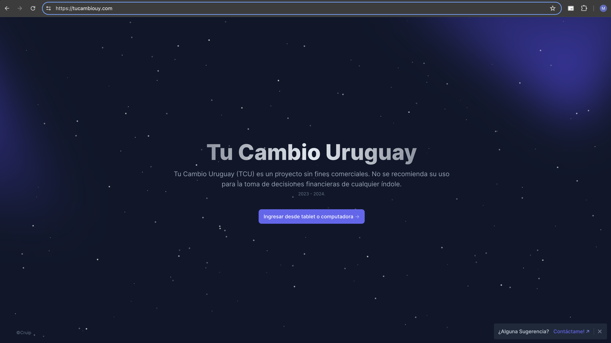
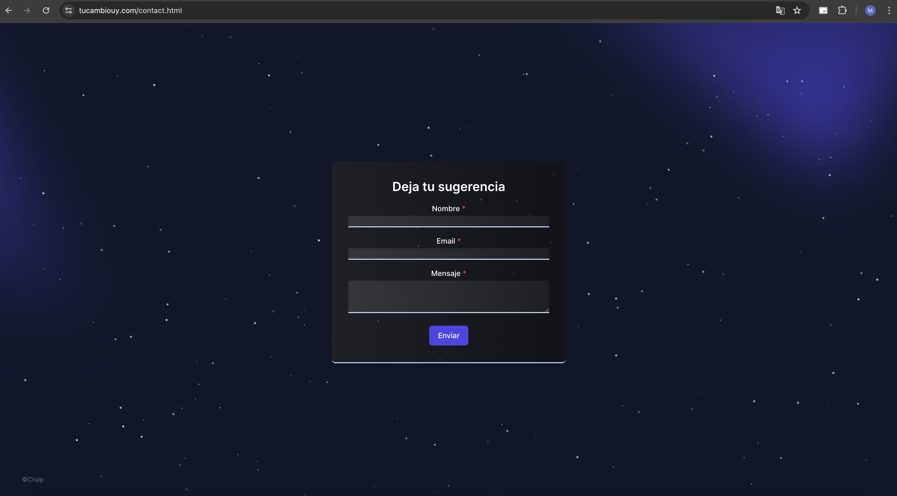
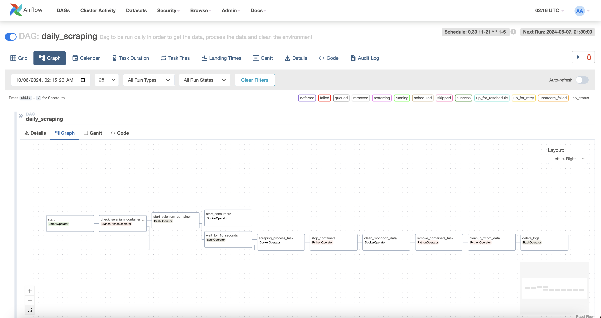
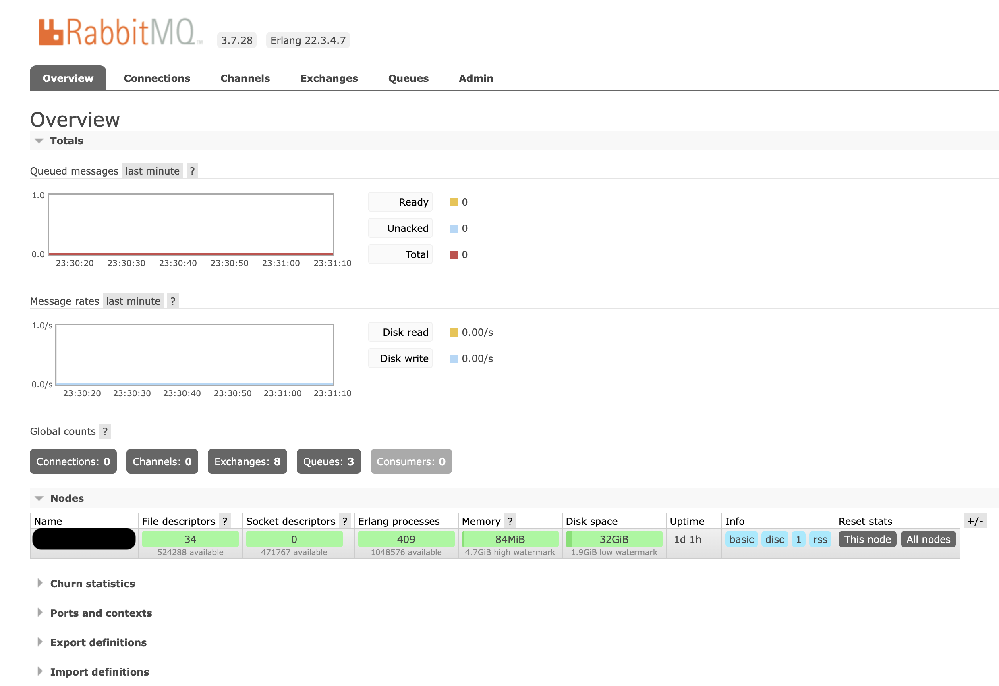
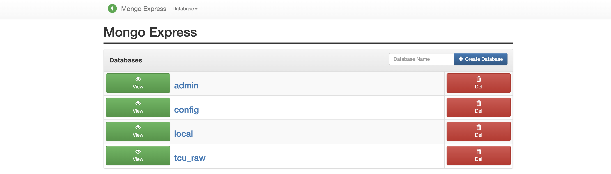
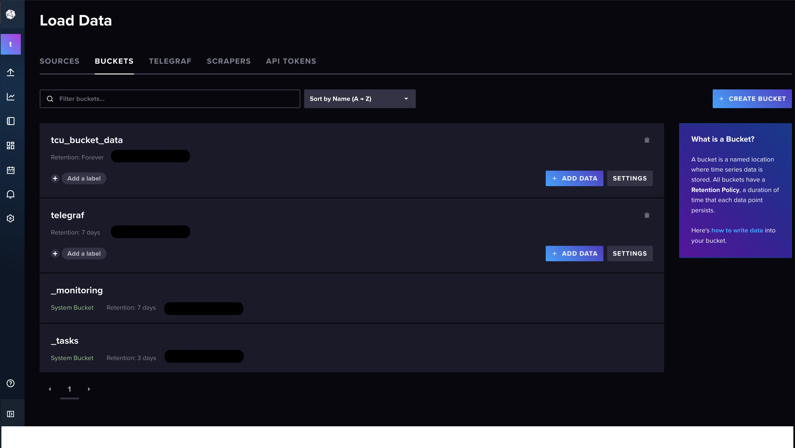
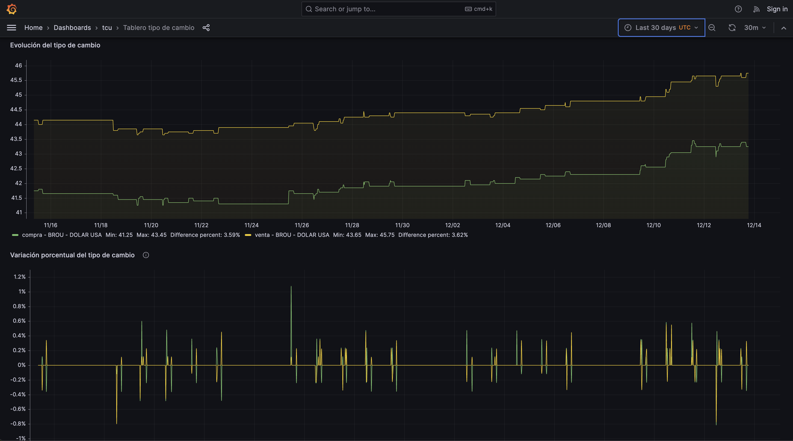
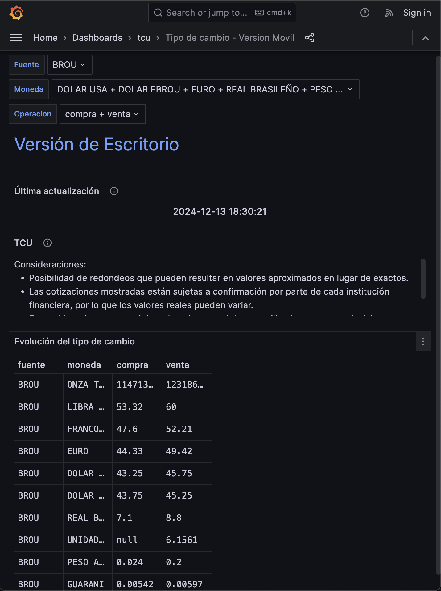

# EXCHANGE RATE PROJECT - URUGUAY

This document aims to provide a guide for those interested in understanding the purpose and scope of the project. It offers a detailed explanation of each component, its function, and the reasoning behind its use. Diagrams will also be included to help clarify the concepts discussed.

## Project Objective:
The project seeks to collect data on buying and selling exchange rates for various currencies from different institutions. This information is retrieved from the official websites of each institution at predefined intervals (every 30 minutes).

Below is a table displaying the institutions and exchange rates that are currently retrieved:

| Currency           | Aspen | Bacacay | Brou  | Cambilex | Gales | Misiones | Obelisco | Varlix |
|--------------------|-------|---------|-------|----------|-------|----------|----------|--------|
| CIERRE BILLETE USA | -     | YES     | -     | -        | -     | -        | -        | -      |
| Dolar USA          | YES   | YES     | YES   | YES      | YES   | YES      | YES      | YES    |
| DOLAR USA EBROU    | -     | -       | YES   | -        | -     | -        | -        | -      |
| EURO               | YES   | YES     | YES   | YES      | YES   | YES      | YES      | YES    |
| FRANCO SUIZO       | -     | -       | YES   | -        | -     | -        | -        | -      |
| GUARANÍ            | -     | -       | YES   | -        | -     | -        | -        | -      |
| LIBRA ESTERLINA    | -     | -       | YES   | -        | -     | -        | -        | -      |
| PESO ARGENTINO     | YES   | YES     | YES   | YES      | YES   | YES      | YES      | YES    |
| PESO CHILENO       | -     | YES     | -     | -        | -     | -        | -        | -      |
| REAL BRASILEÑO     | YES   | YES     | YES   | YES      | YES   | YES      | YES      | YES    |
| UNIDAD INDEXADA    | -     | -       | YES   | -        | -     | -        | -        | -      |
| ONZA TROY DE ORO   | -     | -       | YES   | -        | -     | -        | -        | -      |

The project is purely educational, designed to integrate various technologies to build a functional end-to-end solution. The process includes data extraction, transformation, loading, and concludes with data visualization.

## Data Extraction Process:
The first step in the process is data ingestion. Web scraping techniques, implemented using Python, are employed to extract relevant information (currencies and exchange rates) by parsing the structure of each website. Given that each institution maintains its own website, a separate file is generated for each site to simplify subsequent processing and ensure ease of code maintenance.

## Data Transformation Process:
Once the data is retrieved, the transformation process begins. This phase is responsible for cleaning the data, which includes tasks such as standardizing decimal separators, unifying currency names, removing accents, and adding columns for the extraction timestamp and source. After these adjustments, the data is stored in the production database, from which visualizations will be generated.

It's important to note that all these transformations are carried out in Python.

## Data Loading (Storage) Process:
The storage phase consists of two initial stages. The first stage involves storing the raw data.
Once the data is retrieved, it is temporarily stored in a MongoDB database, which serves as a backup in case the processing script encounters an error (such as unexpected changes in the web page structure) that prevents data from being loaded into the production database.

The second stage involves storing the data in an InfluxDB database, from which the necessary queries will be made.

## Architecture Diagram:

## Technologies Used and Justification:
The following technologies were employed to build the solution:

**DigitalOcean Server**: This server hosts the entire project, providing the infrastructure needed to run all services.

**Git & GitHub**: Version control tools used to manage the development and deployment processes.

**Docker**: Containerization technology that forms the foundation of the project. Docker is used to deploy all developed services, simplifying the process of moving code from local environments to production while avoiding dependency and versioning issues. It also facilitates rapid service updates.

**MongoDB**: A NoSQL database used for temporary storage of raw data. It serves as a backup in case the processing fails. Once the successful loading of data into the production database is confirmed, these records are removed. MongoDB is chosen because it's ideal for storing semi-structured data and is highly effective for filtering by values.

**Mongo-Express**: A tool that provides an easy-to-use interface for interacting with MongoDB records. While not essential, it simplifies database access. The downside is that it introduces a potential vulnerability by requiring the exposure of a port. However, since the data is public, this is not a significant concern for the project.

**InfluxDB**: A NoSQL database optimized for time-series data. It was selected due to its efficient handling of time-based queries and aggregations, making it well-suited for managing and analyzing temporal data.

**RabbitMQ**: A message queuing system used to facilitate the transfer of raw data to MongoDB, processed data to InfluxDB, and error notifications. It enables asynchronous data processing and decoupling, meaning the system does not need to wait for all records to be written to MongoDB before continuing with processing. While this component is not strictly necessary due to the low volume of records, it provides educational value.

**Grafana**: A web-based visualization tool that allows users to view relevant graphs and data insights.

**Telegraf**: A server agent responsible for collecting metrics related to containers and the DigitalOcean server. These metrics help determine if container resource adjustments or system scaling are needed.

Together, Grafana, InfluxDB, and Telegraf form what is known as the TIG stack.

**Nginx**: A powerful web server and reverse proxy used to serve the solution securely and efficiently.

**Certbot**: A tool used to generate SSL certificates that enable secure HTTPS connections.

**Airflow**: A process orchestration tool used to schedule, execute, and manage containers and metadata, ensuring smooth operation and storage management.

## Status as of 2024-12-14 (YYYY-MM-DD):
#### Frontend (Ngnix + Cerbot)

This page serves as the gateway to the main dashboard, allowing users to securely access the platform (HTTPS).

A Contact section is available for users who wish to provide feedback or reach out with inquiries.

#### Scheduler (Airflow)

This image illustrates the various steps involved in each execution of the flow.

#### Message Queue (RabbitMQ)

RabbitMQ used as the distribution layer
Three queues created:
- **Raw Data**: Stores the data before processing.
- **Processed Data**: Holds the data after successful processing.
- **Failure Alerts**: Contains notifications for errors or processing failures.

#### Document-oriented database (MongoDB & Mongo-Express)

**tcu_raw**: Used as the backup database to store data in case of parsing or HTTP errors.

#### InfluxDB

2 buckets created:
- **tcu_bucket_data** : Used to store final data. Retention period: Forever.
- **telegraf**: Collects metrics from the Telegraf agent to monitor the performance of containers and the server.. Retention period: 7 days.

#### Grafana

Desktop grafana version used for visualizing data.
The desktop version provides the following filtering options:  
- **Source**: Filter by the source of data.  
- **Currency Type**: Filter based on the type of currency.  
- **Transaction Type**: Filter for buy or sell operations.  
- **Selected Period**: Choose from pre-defined time periods or select a custom date range.  

### Available Graph Types

The application offers three distinct types of graphs for data visualization:

1. **Exchange Rate Evolution**  
   Displays the raw exchange rate values based on the selected filters.

2. **Percentage Variation of Exchange Rates**  
   Visualizes the percentage changes in exchange rates over time.

3. **Exchange Rate Spread**  
   Illustrates the difference between selling and buying rates.

Mobile grafana version used for visualizing data on mobile devices.
